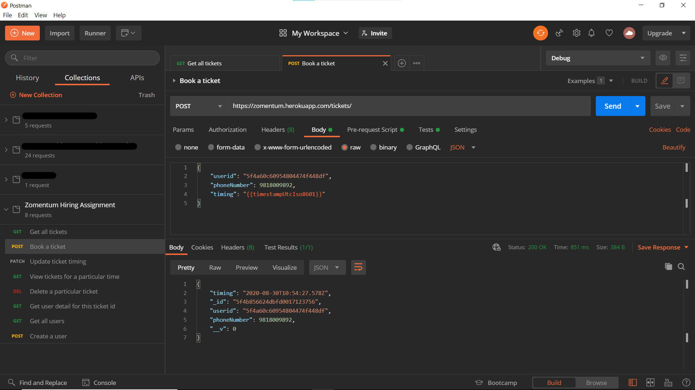

# REST API for Zomentum Hiring Assignment

API for a movie booking system. https://zomentum.herokuapp.com/users

## Schema

### Users

```js
{
  "_id": ObjectID,
  "username": { "type": String, "required": true },
  "firstname": String,
  "lastname": String
}
```

**Note**: Since username is not the primary key in the above schema it can be unique and change.

### Tickets

```js
{
  "userid": {
    "type": mongoose.Schema.Types.ObjectId,
    "ref": "Users",
    "required": true
  },
  "phoneNumber": Number,
  "timing": { "type": Date, "default": Date.now(), "required": true }
}
```

#### **Note**:

1. `userid` is a reference to `_id` in the Users collection
1. The `expiry` field is not included because all the tickets where `currentTime - timing < 8 hours` are automatically deleted. Thus, all the tickets currently in DB mean they have not yet expired and there is no need to store redundant information.

## Tech Stack

| Technology | About                                             |
| ---------- | ------------------------------------------------- |
| Node.js    | JavaScript runtime environment for server         |
| Express    | Web application framework for Node.js             |
| MongoDB    | Cross-platform document-oriented database program |
| Agenda.js  | Lightweight job scheduling for Node.js            |
| Heroku     | Platform for hosting applications                 |

## Checkpoints

- [x] An endpoint to book a ticket using a user’s name, phone number, and timings.
- [x] An endpoint to update a ticket timing.
- [x] An endpoint to view all the tickets for a particular time.
- [x] An endpoint to delete a particular ticket.
- [x] An endpoint to view the user’s details based on the ticket id.
- [ ] Mark a ticket as expired if there is a diff of 8 hours between the ticket timing and current
      time. `Skipped.` [See note](#note)
- [x] For a particular timing, a maximum of 20 tickets can be booked.
- [x] Create a proper readme for your project.
- [x] Plus point if you could delete all the tickets which are expired automatically.
- [x] Plus point if you could write the tests for all the endpoints. `Test written in Postman`
- [x] Please attach a screenshot of your postman while testing your application. `Postman document collection made instead of screenshot. It contains example for all the APIs. https://documenter.getpostman.com/view/9591717/TVCcXUxw`

## API

Documentation about the API is hosted as a collection on Postman. It also includes examples.

### https://documenter.getpostman.com/view/9591717/TVCcXUxw

## Screenshot


